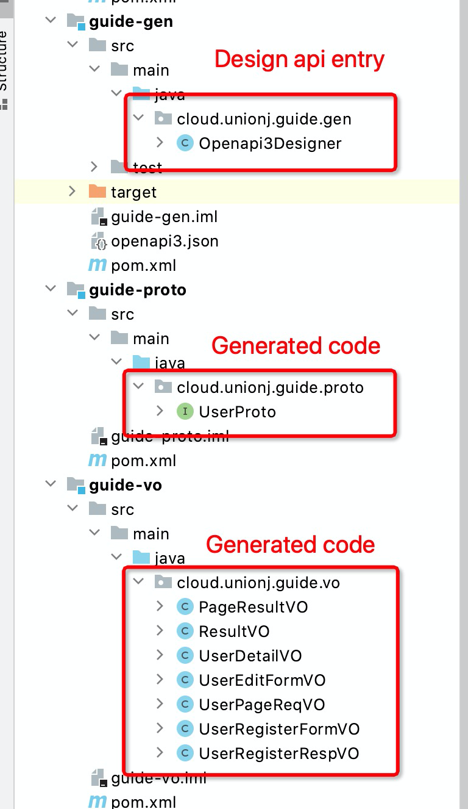

# unionj-generator
unionj-generator is a collection of code generators with a restful api design tool(DSL) implementing
[OpenAPI 3.0.0 specification](http://spec.openapis.org/oas/v3.0.3).

Including：
- backend: Using dsl to generate VO and Proto(interface for controller or feign client to implement) for spring boot backend
- frontend: Using dsl or OpenAPI3 json file to generate typescript vue project scaffold with axios api clients built-in
- mock: Using dsl or OpenAPI3 json file generating request handlers for [mswjs](https://github.com/mswjs/msw)
- openapi: dsl implementing [OpenAPI 3.0.0 specification](http://spec.openapis.org/oas/v3.0.3)
- service: Using dsl or OpenAPI3 json file generating typescript axios api clients

<!-- START doctoc generated TOC please keep comment here to allow auto update -->
<!-- DON'T EDIT THIS SECTION, INSTEAD RE-RUN doctoc TO UPDATE -->
### TOC

- [Installation](#installation)
- [Usage](#usage)
  - [Demo project](#demo-project)
  - [Recommend project structure](#recommend-project-structure)
  - [DSL](#dsl)
    - [Schema](#schema)
      - [Example](#example)
      - [SchemaHelper](#schemahelper)
      - [Generic](#generic)
        - [Syntax](#syntax)
    - [Path](#path)
      - [Example](#example-1)
  - [Backend](#backend)
    - [Example](#example-2)
  - [Frontend](#frontend)
    - [Example](#example-3)
- [Tutorials](#tutorials)
- [TODO](#todo)

<!-- END doctoc generated TOC please keep comment here to allow auto update -->

# Installation

There are two steps.
- Clone this repository
```
git clone git@github.com:unionj-cloud/unionj-generator.git
```
- **Checkout v1.6.0**
```
git checkout v1.6.0
```
- Install
```
mvn clean install -Dmaven.test.skip=true
```
- Copy the following code to your project pom.xml
```
<dependency>
   <groupId>cloud.unionj</groupId>
   <artifactId>unionj-generator-frontend</artifactId>
   <version>1.6.0</version>
</dependency>
<dependency>
   <groupId>cloud.unionj</groupId>
   <artifactId>unionj-generator-backend</artifactId>
   <version>1.6.0</version>
</dependency>
<dependency>
   <groupId>cloud.unionj</groupId>
   <artifactId>unionj-generator-openapi</artifactId>
   <version>1.6.0</version>
</dependency>
<dependency>
   <groupId>cloud.unionj</groupId>
   <artifactId>unionj-generator-mock</artifactId>
   <version>1.6.0</version>
</dependency>
<dependency>
   <groupId>cloud.unionj</groupId>
   <artifactId>unionj-generator-service</artifactId>
   <version>1.6.0</version>
</dependency>
```


# Usage

## Demo project

It's a simple typescript http client code download restful service project. Upload OpenAPI3 spec json file, download ts code.
It's used in our company project.

Repo: https://github.com/unionj-cloud/openapi-svc

Screenshot:


## Recommend project structure

Repo: https://github.com/unionj-cloud/unionj-generator-guide



## DSL

### Schema

#### Example

```java
import static cloud.unionj.generator.OpenAPI3.dsl.Schema.schema;
import static cloud.unionj.generator.OpenAPI3.dsl.SchemaHelper.*;

public class Components {

  private static Schema sizeProperty = int32("每页条数，默认10，传-1查出全部数据");

  private static Schema currentProperty = int32("当前页，从1开始");

  private static Schema offsetProperty = int32("偏移量");

  private static Schema sortProperty = string("排序条件字符串：排序字段前使用'-'(降序)和'+'(升序)号表示排序规则，多个排序字段用','隔开",
      "+id,-create_at");

  private static Schema pageProperty = int32("当前页，从1开始");

  private static Schema limitProperty = int32("每页条数，默认10, 传-1查出全部数据", 10);

  private static Schema maxPageProperty = int32("导出结束页");

  private static Schema totalProperty = int64("总数，入参传入此参数则不再查询count，以此total为准");

  private static Schema topStatusProperty = int32("需要排在前的状态");
  
  public static Schema PageResultVO = schema(sb -> {
    // Schema type. Required.
    sb.type("object");
    // Schema title. Required. Otherwise the generator tool won't know it.
    sb.title("PageResultVO");
    // Generic as List<T>
    sb.properties("items", ListT);
    sb.properties("total", totalProperty);
    sb.properties("size", sizeProperty);
    sb.properties("current", currentProperty);
    sb.properties("searchCount", bool);
    sb.properties("pages", int32("当前分页总页数"));
    sb.properties("offset", offsetProperty);
  });
  
  public static Schema RankVO = schema(sb -> {
    sb.type("object");
    sb.title("RankVO");
    sb.description("排行榜");
    sb.properties("serialNo", int32);
    sb.properties("name", string);
    sb.properties("income", doubleNumer("累计收入"));
    sb.properties("quantity", int32("完成任务数量"));
  });
  
  public static Schema PageResultVOJobVO = generic(gb -> {
    gb.generic(PageResultVO, ref(RankVO.getTitle()));
  });
}

```


#### SchemaHelper

There are some built-in schemas in cloud.unionj.generator.OpenAPI3.dsl.SchemaHelper.

| Type          | Java                 |
| ------------- | -------------------- |
| int32         | Integer              |
| int64         | Long                 |
| string        | String               |
| bool          | Boolean              |
| floatNumber   | Float                |
| doubleNumer   | Double               |
| dateTime      | java.util.Date       |
| T             | <T>                  |
| ListT         | List<T>              |
| SetT          | Set<T>               |
| stringArray   | List<String>         |
| int32Array    | List<Integer>        |
| int64Array    | List<Long>           |
| floatArray    | List<Float>          |
| doubleArray   | List<Double>         |
| boolArray     | List<Boolean>        |
| dateTimeArray | List<java.util.Date> |
| enums         | enum                 |
| ref           | Object               |
| refArray      | List<Object>         |


#### Generic

##### Syntax

```java
// PageResultVO must has and only has one T like field, e.g. T, List<T>, Set<T>
// It will be represented as PageResultVO<RankVO>
public static Schema PageResultVOJobVO = generic(gb -> {
  gb.generic(PageResultVO, ref(RankVO.getTitle()));
});
```


### Path

#### Example

```java
import static cloud.unionj.generator.OpenAPI3.PathHelper.*;

@Test
public void TestPath() throws IOException {
  OpenAPI3 OpenAPI3 = OpenAPI3(ob -> {
    info(ib -> {
      ib.title("title");
      ib.version("v1.0.0");
    });

    server(sb -> {
      sb.url("http://unionj.cloud");
    });

    // Support GET, POST, PUT, DELETE only.
    post("/hall/onlineSurvey/list", PathConfig.builder()
         .summary("summary")
         .tags(new String[]{"tag1", "tag2"})
         .reqSchema(SearchJobPageResult)
         .respSchema(SearchJobPageResult)
         .build());

    post("/hall/offlineSurvey/update", PathConfig.builder()
         .summary("summary")
         // Second tag will be used as Proto or typescript Service name
         // If there was only one tag, the Proto or typescript Service name will be first part of endpoint
         // e.g. HallProto, HallService
         .tags(new String[]{"tag1", "HallOfflinesurvey"})
         .reqSchema(SearchJobPageResult)
         .respSchema(SearchJobPageResult)
         .build());

    post("/admin/onlineSurvey/top/update", PathConfig.builder()
         .summary("summary")
         .tags(new String[]{"tag1"})
         .parameters(new Parameter[]{
           ParameterBuilder.builder().name("id").in(Parameter.InEnum.QUERY).required(true).schema(string).build(),
           ParameterBuilder.builder().name("top").in(Parameter.InEnum.QUERY).required(true).schema(int32).build(),
         })
         .respSchema(SearchJobPageResult)
         .build());
  });
  Backend backend = BackendDocParser.parse(OpenAPI3);
  SpringbootFolderGenerator springbootFolderGenerator = new SpringbootFolderGenerator.Builder(backend).build();
  springbootFolderGenerator.generate();
}
```


## Backend

### Example

```java
package cloud.unionj.example.proto;

import org.springframework.http.ResponseEntity;
import org.springframework.web.bind.annotation.*;
import org.springframework.web.multipart.MultipartFile;
import java.util.*;
import cloud.unionj.example.vo.*;
import cloud.unionj.example.es.page.PageResult;

public interface AdminProto {

    @PostMapping("/admin/news/list")
    ResultDTO<PageResultVO<NewsVO>> postAdminNewsList(
        @RequestBody BaseSearchCondition body
    );

}
```


## Frontend

### Example

```typescript
/**
* Generated by unionj-generator.
* Don't edit!
*
* @module Example
*/
import BizService from "./BizService";
import type {
  ResultDTOListSubWorkVO,
  ResultDTOListCommentNodeVO,
  ResultDTOListRejectVO,
} from "./types"

export class ExampleService extends BizService{

  constructor(axios: any) {
    super(axios);
  }

  /**
  * GET /example/table/indicator
  *
  * SUMMARY
  * @param indicatorID COMMENT
  * @param assigneeID COMMENT
  * @param userID COMMENT
  * @returns Promise<ResultDTOShIndicatorTableNode> 
  */
  getExampleTableIndicator(
      indicatorID: number,
      assigneeID?: number,
      userID?: number,
  ) :Promise<ResultDTOShIndicatorTableNode> {
    let client = this.axios.get
    if(this.axios.$get) {
      client = this.axios.$get
    }
    return client(this.addPrefix(`/example/table/indicator`),
          {
            params: {
              indicatorID,
              assigneeID,
              userID,
            },
          }
        )
  }
}

export default ExampleService;
```

# Tutorials
- [unionj-generator快速上手-后端篇](https://www.jianshu.com/p/21c670ba90f1)

# TODO

- [x] Java generic support
- [x] Typescript service comment and type comment generation
- [x] maven plugin for directly generating server side code from dsl [unionj-generator-maven-plugin](https://github.com/unionj-cloud/unionj-generator-maven-plugin)
- [ ] Integrate springdoc-openapi-ui and generate swagger v3 annotation in code
  for providing request parameters and request body validation feature  
  ~~- [ ] Java proto and vo code generation from OpenAPI3 json file~~: give up
- [ ] Java proto comment and vo comment generation
- [ ] CI & CD support
- [ ] React project scaffold generation
- [ ] Angular project scaffold generation
- [ ] Nodejs client generation
- [ ] Go client generation
- [ ] Add more unit tests
- [ ] Add more tutorials

